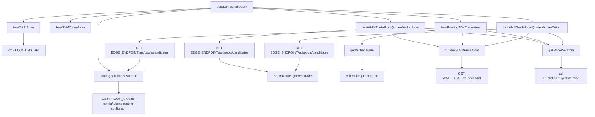
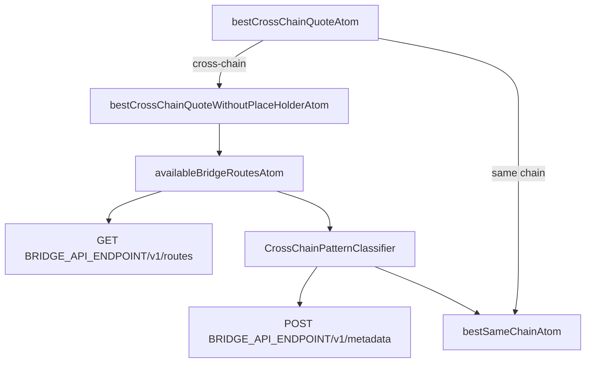
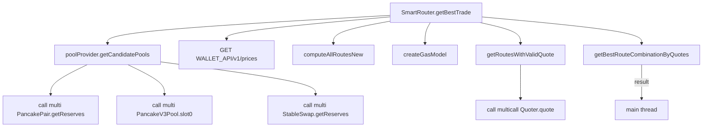
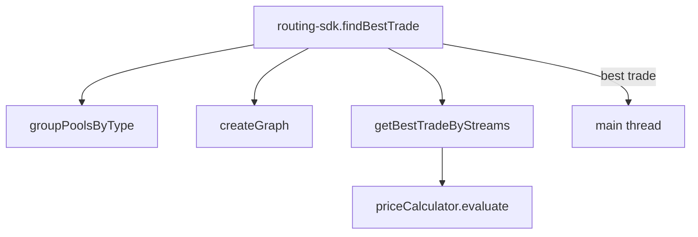
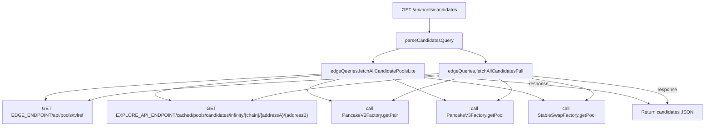
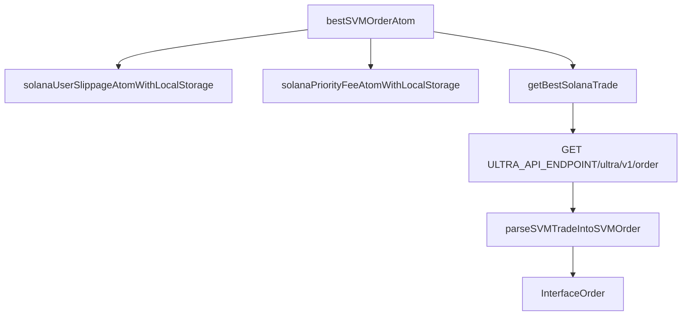

# Quote Routing Visualization

This document visualizes the `quoter` function of PancakeSwap.

1. Visualize the flow of the algorithm.

2. Visualize how calls happen
   - For api calls , using the api path as a node
   - For contract calls using `call [contractName].[contractFunction]

3. Parts
   - Part I: Same Chain Quoter in `apps/web`
   - Part II: Cross Chain Quoter in `apps/web`
   - Part III: The `quoter-worker` -> `Smart Router`
   - Part IV: The `quoter-worker` -> `Routing SDK`
   - Part V: The `edge API`
   - Part VI: The `svm` related flow, entry is `bestSVMOrderAtom`

## Part I (Same Chain Quoter in apps/web)

### Entry

`apps/web/src/quoter/atom/bestSameChainAtom.ts`

### Related Files

- `apps/web/src/hooks/useCurrencyUsdPrice.ts`
- `apps/web/src/quote-worker.ts`
- `apps/web/src/quoter/atom/bestAMMTradeFromQuoterWorker2Atom.ts`
- `apps/web/src/quoter/atom/bestAMMTradeFromQuoterWorkerAtom.ts`
- `apps/web/src/quoter/atom/bestRoutingSDKTradeAtom.ts`
- `apps/web/src/quoter/atom/bestSVMOrderAtom.ts`
- `apps/web/src/quoter/atom/bestSameChainAtom.ts`
- `apps/web/src/quoter/atom/bestXAPIAtom.ts`
- `apps/web/src/quoter/atom/routingStrategy.ts`
- `apps/web/src/quoter/utils/gasPriceAtom.ts`
- `apps/web/src/quoter/utils/getVerifiedTrade.ts`

### Flowchart

## Part II (Cross Chain Quoter in apps/web)

### Entry

`apps/web/src/quoter/atom/bestCrossChainAtom.ts`

### Related Files

- `apps/web/src/quoter/atom/availableBridgeRoutesAtom.ts`
- `apps/web/src/quoter/atom/bestCrossChainAtom.ts`
- `apps/web/src/quoter/atom/bridgeOnlyQuoteAtom.ts`
- `apps/web/src/quoter/atom/bestSameChainAtom.ts`
- `apps/web/src/quoter/utils/crosschain-utils/CrossChainPatternClassifier.ts`
- `apps/web/src/quoter/utils/crosschain-utils/utils/ContextBuilder.ts`

### Flowchart

## Part III (quoter-worker -> Smart Router)

### Entry

`packages/smart-router/evm/v3-router/getBestTrade.ts`

### Related Files

- `apps/web/src/quote-worker.ts`
- `packages/smart-router/evm/v3-router/getRoutesWithValidQuote.ts`
- `packages/smart-router/evm/v3-router/providers/onChainQuoteProvider.ts`
- `packages/smart-router/evm/v3-router/functions/computeAllRoutesNew.ts`
- `packages/smart-router/evm/v3-router/functions/getBestRouteCombinationByQuotes.ts`

### Flowchart

This phase gathers candidate pools, computes viable routes, quotes them through the on-chain quoter contracts, and finally
selects the optimal route combination based on gas and output metrics.

## Part IV (quoter-worker -> Routing SDK)

### Entry

`packages/routing-sdk/src/findBestTrade.ts`

### Related Files

- `apps/web/src/quote-worker.ts`
- `packages/routing-sdk/src/graph/index.ts`
- `packages/routing-sdk/src/utils/getBetterTrade.ts`
- `packages/routing-sdk/src/stream/index.ts`

### Flowchart

The routing SDK operates off chain: pools are grouped, a graph is built, and a price calculator evaluates possible streams of
routes to determine the best trade. No on-chain quoter calls are performed in this phase.

## Part V (edge API)

### Entry

`apps/web/src/pages/api/pools/candidates.ts`

### Related Files

- `apps/web/src/quoter/utils/edgeQueries.util.ts`
- `apps/web/src/quoter/utils/edgePoolQueries.ts`

### Flowchart

## Part VI (svm flow)

### Entry

`apps/web/src/quoter/atom/bestSVMOrderAtom.ts`

### Related Files

- `packages/utils/user/slippage.ts`
- `packages/utils/user/solanaPriorityFee.ts`
- `packages/solana-router-sdk/src/getBestTrade.ts`
- `apps/web/src/quoter/utils/svm-utils/parseSVMTradeIntoSVMOrder.ts`

### Flowchart

