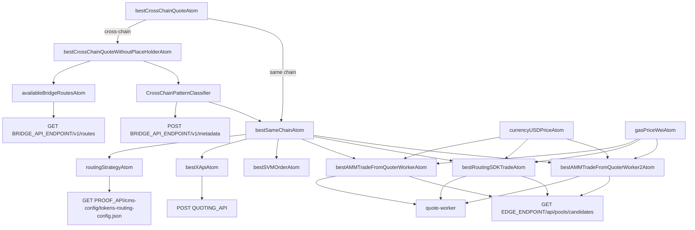
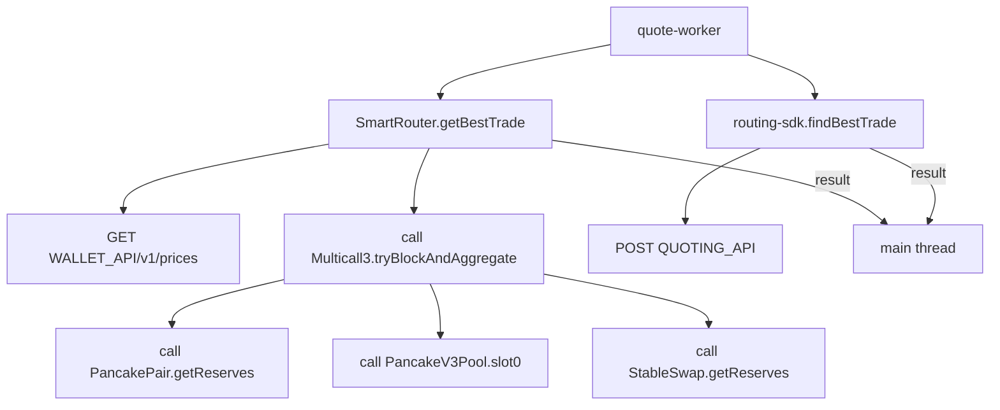
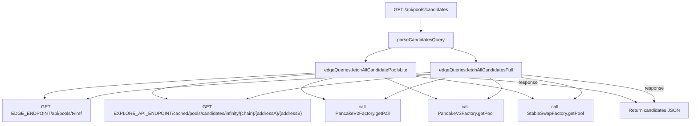

# Quote Routing Visualization

This document sketches the background for how the quoter computes prices in
PancakeSwap. It follows the atoms that initiate a quote, the worker threads that
resolve routing, and the external APIs and smart contracts contacted along the
way. The diagrams below break down the cross‑chain and same‑chain flows, the
quote worker logic, and the `/api/pools/candidates` helper endpoint.

## Part I (atom)

## Part II (worker)

## Part III (edge API)

