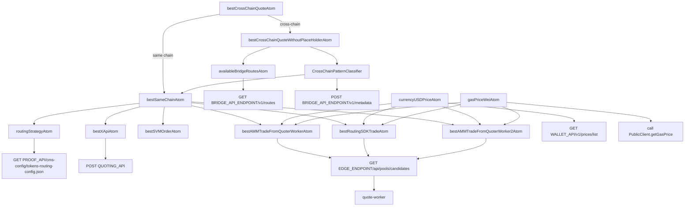
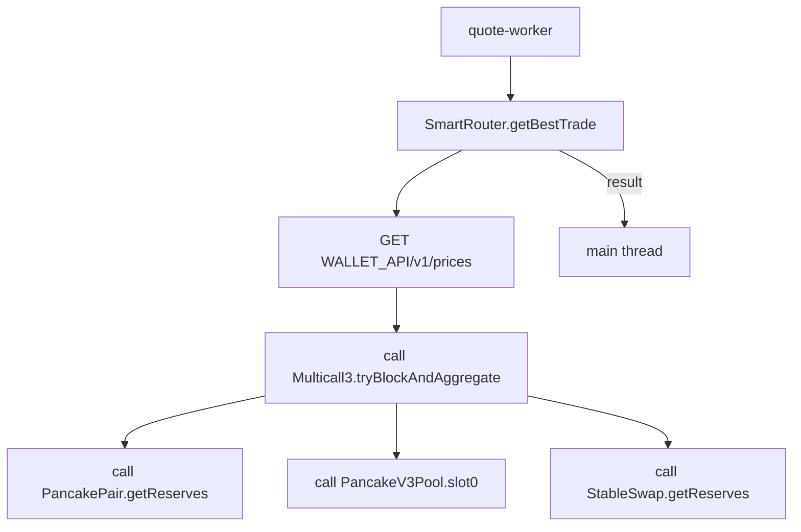
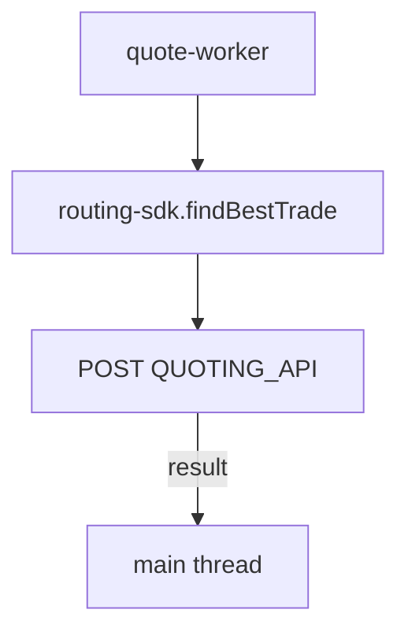
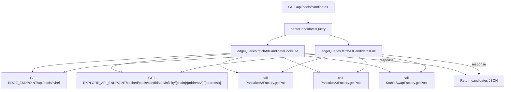
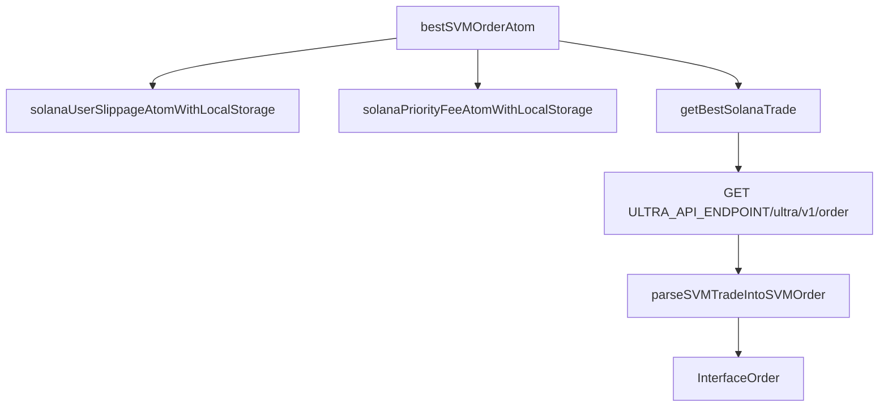

# Quote Routing Visualization

This document visualize the `quoter` function of pancakeswap.

1. Visualize the flow of the algorithm.

2. Visualize how calls happens

   - For api calls , using the api path as a node
   - For contract calls using `call [contractName].[contractFunction]

3. Parts
   - Part I: flow in `apps/web`, entry is `bestCrossChainQuoteAtom`
   - Part II: The `quoter-worker` -> `Smart Router`
   - Part III: The `quoter-worker` -> `Routing SDK`
   - Part IV: The `edge API`
   - Part V: The `svm` related flow, entry is `bestSVMOrderAtom`

## Part I ( apps/web/quoter )

### Entry

`apps/web/src/quoter/atom/bestCrossChainAtom.ts`

### Related Files

- `apps/web/src/quoter/atom/bestSameChainAtom.ts`
- `apps/web/src/quoter/atom/availableBridgeRoutesAtom.ts`
- `apps/web/src/quoter/utils/crosschain-utils/CrossChainPatternClassifier.ts`
- `apps/web/src/quoter/atom/routingStrategy.ts`
- `apps/web/src/quoter/atom/bestXAPIAtom.ts`
- `apps/web/src/quoter/atom/bestSVMOrderAtom.ts`
- `apps/web/src/quoter/atom/bestAMMTradeFromQuoterWorkerAtom.ts`
- `apps/web/src/quoter/atom/bestRoutingSDKTradeAtom.ts`
- `apps/web/src/quoter/atom/bestAMMTradeFromQuoterWorker2Atom.ts`
- `apps/web/src/quote-worker.ts`
- `apps/web/src/hooks/useCurrencyUsdPrice.ts`
- `apps/web/src/quoter/utils/gasPriceAtom.ts`

### Flowchart

## Part II (quoter-worker -> Smart Router)

### Entry

`apps/web/src/quote-worker.ts`

### Related Files

- `packages/smart-router/evm/v3-router/getBestTrade.ts`

### Flowchart

## Part III (quoter-worker -> Routing SDK)

### Flowchart

### Entry

`apps/web/src/quote-worker.ts`

### Related Files

- `packages/routing-sdk/src/findBestTrade.ts`

## Part IV (edge API)

### Entry

`apps/web/src/pages/api/pools/candidates.ts`

### Related Files

- `apps/web/src/quoter/utils/edgeQueries.util.ts`
- `apps/web/src/quoter/utils/edgePoolQueries.ts`

### Flowchart

## Part V (svm flow)

### Entry

`apps/web/src/quoter/atom/bestSVMOrderAtom.ts`

### Related Files

- `packages/utils/user/slippage.ts`
- `packages/utils/user/solanaPriorityFee.ts`
- `packages/solana-router-sdk/src/getBestTrade.ts`
- `apps/web/src/quoter/utils/svm-utils/parseSVMTradeIntoSVMOrder.ts`

### Flowchart

